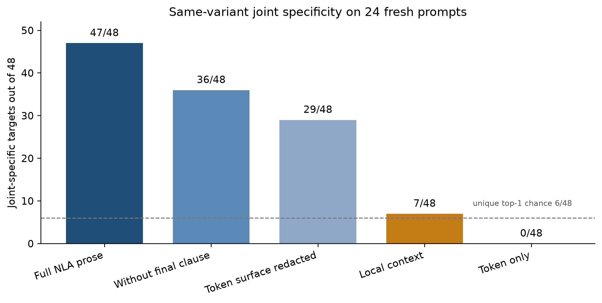

# Matched-decoy tests of NLA prose

Does natural-language-autoencoder text carry more source-specific information than naming the tokenizer token or quoting a local window?

On the released Qwen2.5-7B layer-20 NLA, full prose was jointly specific on 47 of 48 content activations. A tokenizer-only line was specific on none. A ±5-token local window was specific on 7. Keeping the final token clause and swapping in another prompt's scene still won 48/48. Unique identification does not need the true scene. That is not human-semantic faithfulness.

An earlier 24-prompt set was 48/48 at content positions and 0/24 at the after-user chat boundary, where every generation was malformed.

Start here: [write-up](pilots/wildcard-nla/output-validity/WRITEUP.md).



## Studies

| Study | What it tests | Result |
|---|---|---|
| [Output validity](pilots/wildcard-nla/output-validity/RESULT.md) | Matched-decoy reconstruction + one-position JSD | 48/48 content, 0/24 boundary |
| [Clause ablation](pilots/wildcard-nla/clause-ablation/RESULT.md) | Which clauses survive against frozen full decoys | `final_only` 48/48; `generic_only` 5/48 |
| [Context baselines](pilots/wildcard-nla/context-baselines/RESULT.md) | Same-variant full prose vs token line vs local window | 47/48 vs 0/48 vs 7/48 |
| [Semantic prefix swap](pilots/wildcard-nla/semantic-swap/RESULT.md) | Keep last clause, steal another scene | 48/48; `TOKEN_CLAUSE_DOMINATES` |

Each study directory has a frozen `PROTOCOL.md`, a `RESULT.md`, figures, and the sealed `results/decision.json`. GPU activations (`.pt`) are not in this repo; they can be regenerated from the pinned checkpoints.

## Code

- `code/nla/run_output_validity_study.py`
- `code/nla/run_clause_ablation.py`
- `code/nla/run_context_baseline_study.py`
- `code/nla/run_semantic_swap_study.py`
- Slurm launchers in `code/run_nla_*.slurm`. Set `NLA_ROOT` to the repo root; default is `$PWD`.

CPU tests:

```bash
python3 -m unittest discover -s tests -v
```

Checkpoints are the released Hugging Face revisions recorded in the write-up. Local weights are not checked in.

## What this does not claim

The JSD endpoint is a one-position, AR-mediated next-token test. The swap shows the last clause is enough for unique rank. I would not call that an explanation a person could use.
