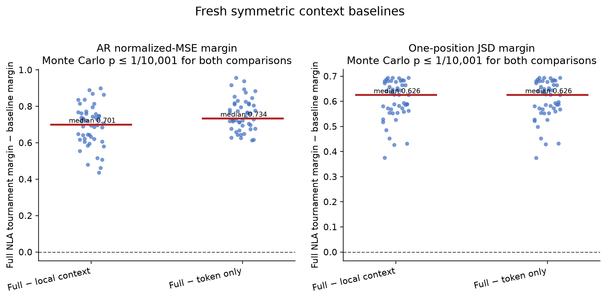

# Experiment 3: symmetric context baselines

## Authoritative record

The authoritative artifacts are the sealed deterministic reproducibility run at [`results/latest/`](./results/latest/), currently `runs/job-21461368/`. Job `21461368` ran on one L40S (`node4103`) and completed in 8m41s with exit 0. Its [`completion-manifest.json`](./results/latest/completion-manifest.json) records hashes for the prompt inventory, protocol, runner, decision file, and 2,576 output artifacts. All six stages passed.

Job `21460276` produced the same internally coherent numerical result, but its artifacts at the top level of `results/` are unsealed and nonauthoritative. The sealed run is a deterministic reproducibility rerun, not an independent confirmation.

## Gate and controls

The final fresh-prompt hash is `4fba0cbe1e4d99070788e15966c87f95a494bc3c046d3a83a3c49635daaacb6b`. Preflight selected 48 content targets from 24 string-disjoint prompts, with distinct tokenizer-token surfaces in each of the six category × position groups. The six-target Experiment 1 bridge gate passed. Gold reinjection maximum JSD was 0.

Median random-direction JSD was `0.6813` versus `0.0636` for full NLA prose. Median unrelated-text AR MSE was `1.1184` versus `0.1637` for full NLA prose.

## Same-variant results

Every category × stratum × variant tournament contains eight targets and eight candidates transformed the same way. The table gives descriptive joint-specific counts.

| Variant | Joint-specific targets |
|---|---:|
| Full NLA prose | 47/48 |
| Token-only baseline | 0/48 |
| Fixed local-context baseline | 7/48 |
| NLA without final clause | 36/48 |
| Full NLA prose with target surface redacted | 29/48 |

The frozen-before-AV primary comparison was full NLA prose against the local-context baseline. The per-target quantity was full tournament margin minus context tournament margin, with each tournament margin defined as median error of the other seven candidates minus own error.

| Comparison | Median AR delta | Median JSD delta | Monte Carlo result |
|---|---:|---:|---|
| Full prose − local context | 0.7006 | 0.6255 | no sign flip of 10,000 matched either metric; `p ≤ 1/10,001` each |
| Full prose − token only | 0.7339 | 0.6256 | no sign flip of 10,000 matched either metric; `p ≤ 1/10,001` each |

The result classification is `PROSE_EXCEEDS_CONTEXT`. The JSD metric is an AR-mediated one-position functional-reconstruction endpoint, not independent behavioral validity.

## Interpretation

Within this fixed fresh prompt set, full NLA prose beat both a tokenizer-only target description and a fixed ±5-token local window in symmetric 8-way tournaments. That rules out the simplest token-plus-window account of the content result for this model/layer and these prompts.

Experiment 2 remains descriptive only for comparative clause claims because its shortened own texts faced frozen full-text decoys rather than same-variant decoys. It is superseded by this study for that question.

This does not establish human-semantic faithfulness, generalize beyond the released Qwen2.5-7B layer-20 checkpoint pair, establish independent downstream behavior, or explain the boundary failure. Boundary activations were excluded by design.
