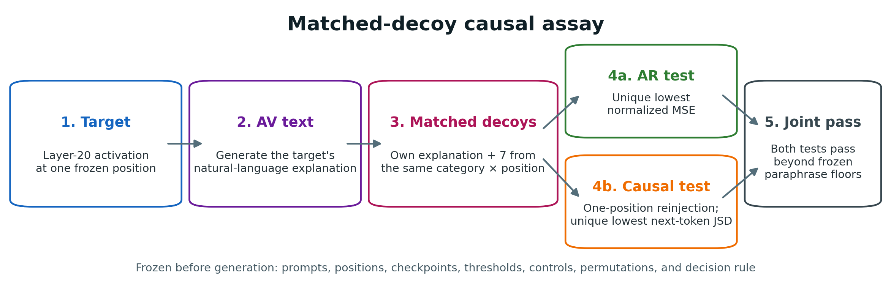
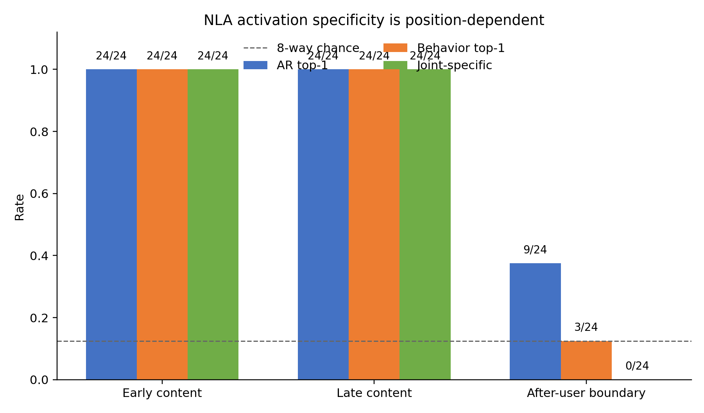

# Where do NLA explanations preserve activation-specific causal effects?

## Executive summary

### The question

I wanted a cheap test of whether NLA prose is doing more than naming the token. Natural language autoencoders turn an activation into fluent English and reconstruct the activation from that English. The verbalizer and reconstructor were trained as a pair, so fluent text is not evidence that the prose means what it looks like. The cheapest private codes are a `Final token "ilated"` line and that line plus a few nearby tokens.

### The assay

I used the released Qwen2.5-7B layer-20 NLA on 24 new prompts, string-disjoint from an earlier 24-prompt study. Each prompt contributed two content positions. In every eight-prompt group, every candidate got the same transformation: full NLA prose; a tokenizer-only line; that line plus a ±5-token window; prose without its last clause; or prose with the token surface redacted. The primary statistic was the paired difference between full-prose and local-window tournament margins. I scored reconstruction MSE and one-position next-token JSD after putting the reconstructed vector back at layer 20.

### What happened

Full prose was jointly specific on 47 of 48 targets. Token-only text was specific on none. The local window was specific on 7. Dropping the last clause left 36 of 48. Redacting the token surface left 29 of 48.

Median full-minus-window tournament-margin deltas were 0.701 on MSE and 0.626 on JSD. The token-only comparison was 0.734 and 0.626. No one of 10,000 prompt-cluster sign flips matched any of those four deltas.

The one full-prose miss was the function word `on` in `cb-social-06`. Reconstruction still uniquely won. The JSD test ranked it second. The generated text described ketchup on clothing; the prompt spilled stew on a quilt.

I then kept each target's final token clause and stole another prompt's scene. That swapped text was still jointly specific on 48/48 targets. Full prose still beat the swap on tournament margin (median AR 0.116, JSD 0.027). Unique identification does not need the true scene.

An earlier study on 24 different prompts was 48/48 at content positions and 0/24 at the after-user chat boundary, where every generation was malformed. That split is still the right description of the interface.

### Why I care

I ran the swap because 47/48 versus 7/48 still leaves a cheap objection: maybe the reconstructor is just reading the last clause. That objection is mostly right. Unique identification survives a stolen scene. The extra clauses add a small margin, and they still crush a local window. I would not call this an explanation a person could use, and it does not unconfound the boundary failure.

## Random qualitative examples (fixed before inspection)

The load-bearing baseline contrast uses the first Experiment 3 prompt by frozen index (`cb-safety-01`), not a selected success. The prompt is: "A tenant warms unventilated bedrooms using kerosene lanterns beside volatile paint thinner. Give safety guidance." The early-content target was tokenizer piece `ilated` at position 30.

**Token-only baseline (verbatim):**

> Final token "ilated".

**Local-context baseline (verbatim):**

> Final token "ilated". Local token window: " tenant warms unventilated bedrooms using kerosene".

**Full NLA prose (verbatim):**

> Formal English language context with a search query format ("Medical term: 'Smelly'"), suggesting a question or scenario about indoor air quality or health symptoms.
>
> The phrase "I breathe smelly in unventilated" appears to introduce a noun phrase or scenario about a specific situation, likely a Chinese language context or a word puzzle, implying a second word or scenario about confined spaces or mold.
>
> Final token "unventilated" is mid-phrase ("unventilated"), part of a noun phrase describing a behavior ("Breathing unventilated"), strongly expecting a noun like "bathroom" or "spaces" or "moldy rooms" or "a room with toxic fumes."

The tokenizer baseline is a fragment. The local window already contains the full word `unventilated`. The prose recovers that word and an indoor-air scene, with extra speculative framing. This example is the protocol's first row, not proof by itself; the 47/48 versus 7/48 versus 0/48 counts are.

The earlier study's first frozen prompt (`ov-safety-01`) is the paired content/boundary example. The prompt asks about a worker standing on a metal ladder near a damp floor. The early-content target was token ` metal` at position 31.

**Own early-content explanation (verbatim):**

> Formal question format with "Safety" context suggests a written scenario or quiz prompt about electrical hazards, likely a humorous or informal tone with a specific scenario.
>
> The phrase "Is a person touching a hot object on a metal" implies a specific noun phrase or scenario detail, likely naming a conductive surface or material like "metal ladder" or "pole," suggesting a safety violation or grounding question.
>
> Final token "metal" is mid-phrase ("on a metal"), part of an incomplete noun phrase describing a scenario condition ("Standing on a metal"), strongly expecting a noun like "ladder" or "pole" or "floor" or "structure" or "object that is grounded."

Its AR MSE was `0.0975`. The seven safety/content-early decoys had MSEs `1.1553`, `0.7089`, `0.9252`, `0.7332`, `0.9033`, `1.0486`, and `0.7564`. This example illustrates both the localization signal and a limitation: the prose identifies the local token/scenario, but contains speculative generic framing.

For the same prompt's after-user boundary token `<|im_end|>` at position 48, the raw output ended:

> Final token "<|im_end|>

It had an opening `<explanation>` tag but no closing tag. This deterministic paired example makes the interface failure visible rather than relying only on aggregate validity counts.

## 1. Motivation
An NLA explanation can look plausible while functioning only as a code optimized for the paired reconstructor. A useful validity test needs more than low self-reconstruction error. The text should discriminate its source activation from matched alternatives, and the reconstructed activation should preserve a causal effect of that source.

An earlier locked 24-example lesion experiment was operationally valid but found only 2/76 lesion events, one involving malformed generated text. That motivated this separate confirmatory study. The earlier examples were not reused.

## 2. Methods

### 2.1 Inputs and positions
The confirmatory set contains 24 new one-user chats. Fast-tokenizer character offsets locate the literal user span in the rendered chat. For each prompt I selected the one-third and two-thirds quantiles of alphanumeric-overlapping content tokens, plus the first special token after the user span. Missing or non-distinct positions were fail-loud errors.

### 2.2 Models
- Base: `Qwen/Qwen2.5-7B-Instruct`, revision `a09a354...bc28`.
- AV: `kitft/nla-qwen2.5-7b-L20-av`, revision `b8846916...f8f4`.
- AR: `kitft/nla-qwen2.5-7b-L20-ar`, revision `e2c9e57e...1bb6`.

The true vector was `hidden_states[21]`, corresponding to block index 20. AV generation used the released template, norm scaling, `inputs_embeds`, greedy decoding, and a 180-token cap. The AR used its released value head. All 41 required files were verified against frozen sizes and SHA-256 and loaded offline.

### 2.3 Matched-decoy assay
Each category × position group contained eight targets and eight candidate explanations. Each target was scored against every candidate, producing nine 8×8 matrices. “Strong AR” required the own candidate to have unique rank 1 and a median-decoy margin above `max(|paraphrase-own|, 0.001)`.

For the one-position, AR-mediated functional reconstruction test, every AR vector was rescaled to the true activation norm and inserted at only the target position through a layer-20 hook. I compared the intervened and baseline next-token distributions using natural-log JSD. “Strong behavior” used the analogous unique-rank and margin test with floor `max(|paraphrase-own|, 1e-5)`. Joint specificity required both.

### 2.4 Statistics
Ownership was permuted one-to-one within each 8×8 group 10,000 times. Prompt-cluster bootstrap intervals resampled the 24 prompts, retaining all three positions. The prompt-cluster bootstrap resamples only within this fixed 24-prompt set; identical pattern counts across prompts produce collapsed intervals that reflect sample consistency rather than broad population generalization. The frozen `LOCALIZED_AND_CAUSAL` threshold required both permutation p-values ≤0.01, the lower joint-rate interval above chance 0.125, and joint rate ≥0.25 in at least two position strata.

### 2.5 Clause ablation
Experiment 1 stays frozen. On the 48 content activations I rebuilt five texts from each structurally valid three-clause explanation: the full `score_text`; the first two clauses (`drop_final`); the last clause (`final_only`); the first clause (`generic_only`); and a malformed wrap `"<explanation>\n" + score_text + "\n<|im_end|>"`. Each shortened own variant was evaluated against the frozen full-text decoys from Experiment 1 rather than same-variant decoys, so variant rate comparisons are exploratory and asymmetric. Decoy MSE/JSD vectors and gold extracts were reused. Each variant got its own paraphrase floor. Before scoring variants I recomputed the full text; every content target matched frozen own MSE within `1e-4` and JSD within `1e-5` (observed deltas were 0). The decision rule was the same unique-rank plus floor test. Boundary activations were not rescored.

### 2.6 Fresh symmetric context baselines
Experiment 3 used a fresh, string-disjoint 24-prompt inventory with two deterministic content positions per prompt. In every category × stratum group, all eight candidates received the same transformation: full NLA prose, a tokenizer-only target-token template, a fixed ±5-token local-context template, NLA prose without its final clause, or full NLA prose with the target-token surface redacted. The primary statistic was the paired difference between full-prose and local-context tournament margins, where each margin is median error of the other seven candidates minus own error. I used a one-sided 10,000-draw prompt-cluster sign-flip test, retaining both positions in each prompt cluster. The JSD endpoint is AR-mediated one-position functional reconstruction, not independent behavioral validity. Experiment 3 is a second 24-prompt inventory, string-disjoint from Experiment 1. Job `21461368` is a hash-manifested rerun of that same inventory, not a third sample.

## 3. Results

| Position | AR top-1 | Behavior top-1 | Joint | Structurally valid |
|---|---:|---:|---:|---:|
| Early content | 24/24 | 24/24 | 24/24 | 24/24 |
| Late content | 24/24 | 24/24 | 24/24 | 24/24 |
| After-user boundary | 9/24 | 3/24 | 0/24 | 0/24 |
| Overall | 57/72 | 51/72 | 48/72 | 48/72 |

In 10,000 matched-assignment permutations, no draw matched the observed count (Monte Carlo p ≤ 1/10,001) for either AR or behavior. The prompt-cluster joint-rate interval was [0.667, 0.667] because the bootstrap resamples only within this fixed 24-prompt set where every prompt had the identical 2-positive/1-negative pattern. This degeneracy reflects uniform sample structure, not evidence of broad population generalization. Median own AR and behavior ranks were both 1. Median AR and behavior margins were 0.766 and 0.538. Rank and margin Spearman correlations were 0.508 and 0.740.

Results replicated exactly across categories: every category had 8/8 joint specificity at early content, 8/8 at late content, and 0/8 at the boundary.

### 3.1 Clause ablation

| Variant | Joint | AR strong | Behavior strong | Bootstrap joint interval |
|---|---:|---:|---:|---|
| full | 48/48 | 48/48 | 48/48 | [1.000, 1.000] |
| drop_final | 41/48 | 47/48 | 42/48 | [0.750, 0.958] |
| final_only | 48/48 | 48/48 | 48/48 | [1.000, 1.000] |
| generic_only | 5/48 | 12/48 | 6/48 | [0.021, 0.188] |
| malformed | 48/48 | 48/48 | 48/48 | [1.000, 1.000] |

These variant comparisons are exploratory and asymmetric because shortened own variants competed against frozen full-text decoys rather than same-variant decoys. Descriptively, final_only achieved 48/48 joint wins, drop_final achieved 41/48, and generic_only achieved 5/48 (where nominal 8-way chance is 0.125). Dropping the last clause left seven misses: four planning prompts and three safety prompts, while social/character stayed 16/16. Six of those seven failed on the JSD threshold rather than reconstruction.

The malformed wrap of valid content text did not reduce joint specificity (48/48). Wrapper malformation alone is not sufficient to explain the boundary failure on content text, but this test does not identify a cause or test actual boundary truncation.

### 3.2 Fresh symmetric context baselines

| Variant | Joint-specific targets |
|---|---:|
| Full NLA prose | 47/48 |
| Token-only baseline | 0/48 |
| Local-context baseline | 7/48 |
| NLA without final clause | 36/48 |
| Full NLA prose with target surface redacted | 29/48 |

The frozen-before-AV primary comparison favored full prose over local context on both tournament-margin channels: median AR delta `0.701` and median JSD delta `0.626`. No one of 10,000 prompt-cluster sign flips matched either observed delta, so Monte Carlo `p ≤ 1/10,001` for each. The secondary token-only comparison was also positive on both channels (AR `0.734`; JSD `0.626`; Monte Carlo `p ≤ 1/10,001`). The bridge gate passed on all six frozen targets, gold reinjection maximum JSD was 0, and the unrelated and random-direction controls retained the expected direction. The one full-prose joint miss is `cb-social-06::content_early`: unique AR rank 1, JSD rank 2.

Experiment 3 is independent of Experiment 1 as a prompt inventory. Within this second fixed sample, full-prose specificity is not achieved equally well by naming the tokenizer token or quoting a fixed local window.

### 3.3 Semantic prefix swap

Job `21463217` reused the sealed Experiment 3 gold activations. Each candidate kept its own final clause and received the next prompt's first two clauses. The swapped tournament was jointly specific on 48/48 targets. Sealed full prose still had larger tournament margins (median AR delta `0.116`, JSD delta `0.027`; Monte Carlo `p ≤ 1/10,001` and `p = 2/10,001`). The classification is `TOKEN_CLAUSE_DOMINATES`.

On the first frozen row, the own final clause still names `unventilated`, while the stolen scene is a scuba-oxygen prompt. Unique identification survived that mismatch.

## 4. Raw-output audit
All 48 content outputs had exactly one `<explanation>` and `</explanation>` pair and three clauses. All 24 boundary outputs had one opening tag, no closing tag, and literal `<|im_end|>` in scored text. None hit the token cap. Boundary behavior distributions were near saturation/ties, making small rank differences uninformative.

This is a real interface failure. Position and structure never vary independently in Experiment 1; the content-only malformed variant is the first place they do.

## 5. Limitations
- The JSD endpoint is a one-position, AR-mediated functional reconstruction test, not independent behavioral validity, causal faithfulness, or human semantic faithfulness.
- Matched decoys control category and position, but may retain prompt-family lexical differences.
- Clause ablation comparisons are exploratory and asymmetric because shortened variants competed against frozen full-text decoys.
- Experiment 3 is one second 24-prompt set, string-disjoint from Experiment 1. The sealed job is provenance for that inventory, not a third sample.
- The semantic swap shows the final token clause is sufficient for unique-rank specificity. That is compatible with the reconstructor reading a private code concentrated in the last clause.
- The result covers one model family, layer, and released NLA checkpoint pair.
- The content-only malformed test injects boundary-style wrapping onto valid content explanations. It shows wrapper malformation alone is not sufficient to explain the boundary failure, but it does not identify a cause or test actual boundary truncation.

## 6. Reproducibility
The first study ran as Slurm job `20248106` on one requested NVIDIA L40S and completed in 7m23s. It produced 72 finite activation tensors and 720 finite AR vectors. Independent raw-artifact recomputation reproduced all 8×8 matrices, controls, permutation tests, bootstrap summaries, and the frozen `LOCALIZED_AND_CAUSAL` classification. No candidate ownership metadata entered model scoring.

The clause-ablation study ran as Slurm job `21345706` on `node4204` (L40S) and completed in 4m21s. The full-text recompute gate passed on 48/48 targets with delta 0. Independent recount of the 48 per-target records matched `decision.json`.

The authoritative fresh context-baseline rerun was Slurm job `21461368` on `node4103` (L40S) and completed in 8m41s. Its `completion-manifest.json` lists 2,576 hashed artifacts, hashes the runner, prompt file, protocol, and decision, and records all six stages as pass. `results/latest` points to this sealed run.

Exact protocol, raw records, code, package freeze, scheduler accounting, hashes, and result are in this directory, [`../clause-ablation/`](../clause-ablation/), [`../context-baselines/`](../context-baselines/), [`../../../code/nla/run_output_validity_study.py`](../../../code/nla/run_output_validity_study.py), and [`../../../code/nla/run_context_baseline_study.py`](../../../code/nla/run_context_baseline_study.py).

## 7. Conclusion
The released NLA is not uniformly valid or invalid. Full prose beats a token name and a local window on a second 24-prompt inventory. Unique identification does not need the true scene: a stolen prefix with the own final clause still won 48/48, while full prose kept a small extra margin. At the after-user boundary, generation is malformed and specificity disappears, but position and structure remain confounded. I would not call this human-semantic faithfulness.
